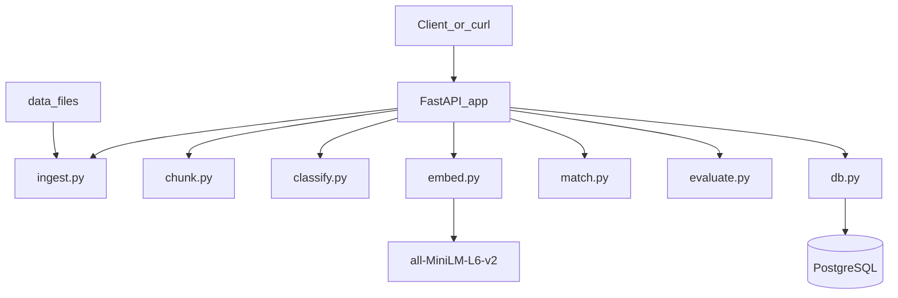

## Azure-Compliance-Processing-Pipeline

Azure-Compliance-Processing-Pipeline is a FastAPI + PostgreSQL service for ingesting compliance policy documents, chunking them into clauses, classifying each chunk, computing similarity to a control library, and exporting structured results. It is designed to run **locally** via Docker Compose while mirroring a cloud-ready, Azure-aligned architecture.

### Architecture (high level)

### Why this is Azure‑aligned

- **FastAPI service** ≈ Azure App Service or Azure Functions hosting the API and pipeline orchestration.
- **PostgreSQL database** ≈ Azure Database for PostgreSQL (or Cosmos DB with PostgreSQL API) holding documents, chunks, controls, matches, and evaluation runs.
- **Local `data/` folder** ≈ Azure Blob Storage for documents, training sets, and control libraries.
- **Pipeline modules** (`ingest`, `chunk`, `classify`, `embed`, `match`, `evaluate`) map cleanly to Azure Functions or Durable Functions activities coordinated via queues (e.g. Azure Service Bus) in a future cloud version.
- This repository is **fully local** and runs only via Docker Compose, but the boundaries mirror typical Azure components.

### How to run locally

- **Prereqs**: Docker and Docker Compose installed.
- **Start stack**:
  - From the repo root:
    - `docker compose up --build`
  - API will be available at `http://localhost:8000`.
- **Run tests** (optional):
  - `docker compose run --rm api pytest`

### Key API endpoints (examples)

- **Health check**
  - `GET /health`
- **Upload a document**
  - `POST /documents` (multipart with `file=@path/to/policy.txt`)
- **List documents**
  - `GET /documents`
- **Process a document end‑to‑end (chunk + classify + match)**
  - `POST /documents/{id}/process`
- **Get per‑chunk results (JSON)**
  - `GET /documents/{id}/results`
- **Export results to CSV**
  - `GET /documents/{id}/export.csv`
- **List control library**
  - `GET /controls`
- **Run evaluation on a processed document**
  - `GET /evaluation/{document_id}`

### How evaluation works

- `data/gold_eval.csv` contains a small gold set mapping `document_id` + `chunk_index` to:
  - `expected_label`
  - `expected_control_id`
- `/evaluation/{document_id}`:
  - Joins stored predictions and similarity matches with the gold rows.
  - Computes:
    - **classification_accuracy** (for labelled chunks),
    - **top1_accuracy** (top‑1 control match),
    - **top3_hit_rate** (whether the expected control appears in top‑3),
    - **support** (number of gold rows used),
    - **report** (short text summary).

### Limitations

- Only `.txt` and `.md` documents are supported (no PDF or OCR).
- Classifier is a simple TF‑IDF + logistic regression baseline trained on a tiny seed dataset.
- SentenceTransformers similarity uses a small model (`all-MiniLM-L6-v2`) and runs synchronously.
- No authentication, rate limiting, or background queueing is implemented; all processing is per‑request.

### Next steps (future work)

- Introduce queue‑based, asynchronous processing (e.g. Azure Service Bus + Functions) for large document sets.
- Add proper authentication/authorization (e.g. Azure AD) and audit logging for access to results.
- Support PDF ingestion and richer pre‑processing (tables, headings, references, etc.).
- Expand and refine training data and gold mappings for stronger evaluation and better labels.

