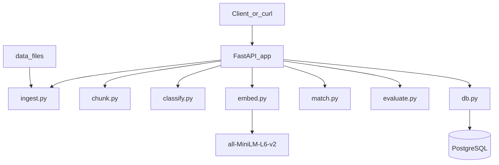

## Azure-Compliance-Processing-Pipeline

An Azure-aligned, local prototype that **turns unstructured compliance policies into actionable, report-ready data.**

Instead of manually reading hundreds of pages of security, privacy, or regulatory policies, this service:
- **Ingests** raw documents (e.g., ISO 27001 policies, internal security standards, vendor policies),
- **Breaks** them into clause-level chunks,
- **Classifies** each chunk into meaningful categories (e.g., Access Control, Incident Management),
- **Maps** them to a **standard control library** (e.g., ISO 27001, NIST 800-53),
- And **exports structured results** that can be used for audits, gap analysis, and evidence packages.

This lets risk, audit, and security teams answer questions like:
- *“Which of our internal policies map to this ISO control?”*
- *“Where are our policy gaps relative to a standard?”*
- *“What evidence can we quickly pull for an external audit?”*

All of this runs **locally** via Docker Compose, but mirrors a cloud-ready architecture that can later be deployed on Azure.

### Real-world problems this solves

- **Manual control mapping is slow and error-prone**
  - Today, analysts read PDFs and copy/paste into spreadsheets.
  - This prototype automates the first 80%: extracting clauses, tagging them, and suggesting control mappings.

- **Difficult to compare internal policies with external standards**
  - Mapping internal policies to ISO/NIST/PCI controls is usually one-off and non-repeatable.
  - Here, everything is stored in a structured database so you can rerun the process as policies or standards change.

- **Unclear coverage and gaps**
  - Leadership wants to know: *“Which controls are fully covered, partially covered, or not addressed?”*
  - By linking clauses to a control library, you can generate coverage reports and spot missing or weak controls.

### Who is this for?

- **Compliance & risk teams**: Faster control mapping, easier evidence gathering, repeatable assessments.
- **Security architects**: Understand how policies align to frameworks and where to prioritize updates.
- **Consulting / advisory teams**: A reusable engine for client assessments instead of bespoke spreadsheets.
- **Engineering teams**: A blueprint for a future Azure-hosted compliance analytics service.

### High-level architecture

### Why this is Azure‑aligned

- **FastAPI service** → maps to **Azure App Service** or **Azure Functions** hosting the API and orchestration.
- **PostgreSQL database** → maps to **Azure Database for PostgreSQL** (or Cosmos DB with PostgreSQL API) for documents, chunks, control mappings, and evaluation runs.
- **Local `data/` folder** → maps to **Azure Blob Storage** for policy documents, control catalogs, and evaluation data.
- **Pipeline modules** (`ingest`, `chunk`, `classify`, `embed`, `match`, `evaluate`) → map to **Durable Functions activities** coordinated via queues (e.g., **Azure Service Bus**) in a production deployment.
- The repo intentionally stays **local-only** but the component boundaries mirror common Azure reference architectures.

### Example business workflow

1. **Upload policies**  
   A compliance analyst uploads internal policy documents and (optionally) a target control library.
2. **Automated processing**  
   The API ingests, chunks, classifies, and generates similarity matches against the control library.
3. **Review & refine**  
   Analysts review the suggested mappings, focusing on edge cases rather than starting from a blank sheet.
4. **Export & reporting**  
   Results are exported to CSV/JSON and can be loaded into Power BI, GRC tools, or internal dashboards.

### How to run locally

- **Prereqs**: Docker and Docker Compose installed.
- **Start stack**:
  - From the repo root:
    - `docker compose up --build`
  - API will be available at `http://localhost:8000`.
- **Run tests** (optional):
  - `docker compose run --rm api pytest`

### Key API endpoints (examples)

- **Health check**
  - `GET /health`
- **Upload a document**
  - `POST /documents` (multipart with `file=@path/to/policy.txt`)
- **List documents**
  - `GET /documents`
- **Process a document end‑to‑end (chunk + classify + match)**
  - `POST /documents/{id}/process`
- **Get per‑chunk results (JSON)**
  - `GET /documents/{id}/results`
- **Export results to CSV**
  - `GET /documents/{id}/export.csv`
- **List control library**
  - `GET /controls`
- **Run evaluation on a processed document**
  - `GET /evaluation/{document_id}`

### How evaluation works (business view)

- `data/gold_eval.csv` contains a small “gold” dataset that says, for certain clauses:
  - What label a human expert chose (`expected_label`),
  - Which control a human chose (`expected_control_id`).
- `/evaluation/{document_id}`:
  - Compares the system’s predictions against the human-labelled gold set.
  - Computes metrics such as:
    - **classification_accuracy** – how often we assign the right label,
    - **top1_accuracy** – how often the top suggested control is correct,
    - **top3_hit_rate** – how often the correct control appears in the top 3 suggestions,
    - **support** – how many gold rows were used,
    - **report** – a short text summary useful for slides or documentation.
  
From a business standpoint, this tells you **how much you can trust the automated mappings** and where human review is still essential.

### Limitations (today)

- Only `.txt` and `.md` documents are supported (no PDF or OCR).
- Classifier is a simple TF‑IDF + logistic regression baseline trained on a small seed dataset.
- SentenceTransformers similarity uses a small model (`all-MiniLM-L6-v2`) and runs synchronously.
- No authentication, rate limiting, or background queueing; all processing is per request.

This is intentionally a **prototype** for validating the workflow and value proposition, not a production-ready system.

### Future directions

- Add **queue‑based, asynchronous processing** (e.g. Azure Service Bus + Functions) to handle large policy libraries.
- Integrate with **Azure AD** and add audit logging to support real compliance environments.
- Support **PDF ingestion** and richer pre‑processing (tables, headings, cross-references).
- Expand training data and gold mappings to improve accuracy across multiple frameworks (ISO, NIST, SOC 2, PCI, etc.).

